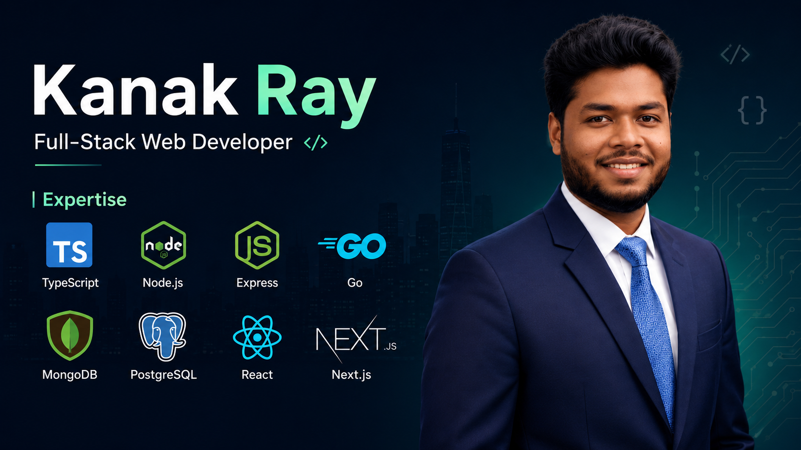

# 👋 Hi, I'm Kanak Ray
### Full-Stack Web Developer | TypeScript, Node.js, Go & PostgreSQL

**[🌐 Visit My Live Portfolio](https://kanak-portfolio-hazel.vercel.app)**

📌 **Connect with me:**

- 🗺️ **Location:** Rangpur, Bangladesh
- 💬 **WhatsApp:** [+88 01704 210835](https://wa.me/8801704210835)
- ✉️ **Email:** [kanakroy835@gmail.com](mailto:kanakroy835@gmail.com)

---

## 🧑‍💻 About Me
I’m a passionate **Full-Stack Developer** from Bangladesh, dedicated to crafting fast, scalable, and type-safe web ecosystems. 

- 💻 **What I Do:** Build end-to-end web applications leveraging the power of **TypeScript**, **Node/Express.js**, **GO**, **React/Next.js**, and robust backend architectures.
- 🗄️ **Database & Optimization:** Experienced in relational and non-relational databases (**PostgreSQL & MongoDB**), utilizing **Prisma** to ensure data integrity and optimized queries.
- 🚀 **My Goal:** To write clean, maintainable code and collaborate on impactful digital solutions that solve real-world problems.

---

## 🌐 Social Links

---

## 🚀 Skills

### Languages

### Frontend

### Backend & Databases

### Auth & Tools

### Design & CMS

---

## 📊 GitHub Stats

  
  

  

---
